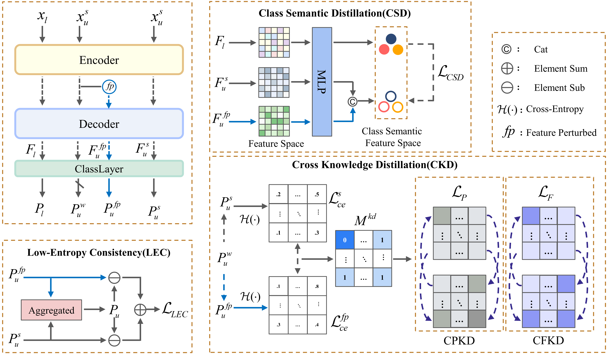

# CRKD

We provide the official PyTorch implementation of our CRKD: **Semi-supervised Medical Image Segmentation via Cross Reliable Knowledge Distillation**:

## Overall Framework
<p align="left">

</p>
## Dataset Acquisition

- ISIC 2018: 
  - [office](https://challenge.isic-archive.com/data/#2018)
  - [ours](https://drive.google.com/file/d/1Ex3McNcLQYa4wJIlHFkNHHlHOBp9HItC/view?usp=sharing)
- Kvasir-SEG: 
  - [office](https://datasets.simula.no/kvasir-seg/)
  - [ours](https://drive.google.com/file/d/133ZNU7ZoCc82vvZrLEKQLJJKpoKS5hif/view?usp=sharing)
- ACDC: [office](https://drive.google.com/file/d/1LOust-JfKTDsFnvaidFOcAVhkZrgW1Ac/view?usp=sharing)
- LA: [image and mask](https://github.com/AiEson/CrossMatch/tree/main/LA)

[//]: # (You can put dataset to `data/` and get data lists in `splits/`.)

## Usage

### train params

You can make your data train params like `configs/isic2018.yaml`

### python train
train on ISIC 2018/Kvasir-SEG use 5% label ratio
```
python train_2d_CRKD.py --config configs/isic2018.yaml --label_rat 0.05
```
train on ACDC use 3-case label ratio
```
python train_2d_ACDC_CRKD.py --config configs/acdc.yaml --labeled_num 3
```
train on LA use 4-case label ratio
```
python train_3d_CRKD.py --config configs/LA.yaml --label_num 4
```
### sh train

```
sh scripts/train.sh
```
## Result
### ACDC
*You can click on the numbers to be directed to corresponding checkpoints.*

3-case(5%)

| Method                      |                                              mDSC                                               | mJac  |  mHD95  | mASD  | 
| :-------------------------: |:-----------------------------------------------------------------------------------------------:|:-----:|:-------:|:-----:|
| Fully-Supervised                 |                                              10.43                                              | 6.08  |  86.56  | 50.38 |
| UniMatch                   |                                              84.72                                              | 74.53 |  4.87   | 1.37  |
| CrossMatch           |                                              84.99                                              | 75.09 |  7.62   | 2.09  |
| **CRKD (Ours)**         | [**85.69**](https://drive.google.com/file/d/1kFgg0SGLzS7SJI8sYPQKGLnw8G060kjz/view?usp=sharing) | 75.88 |  2.97   | 0.85  |


7-case(10%)

| Method                      |                                              mDSC                                               | mJac  |  mHD95  | mASD | 
| :-------------------------: |:-----------------------------------------------------------------------------------------------:|:-----:|:-------:|:----:|
| Fully-Supervised                 |                                              64.19                                              | 50.46  |  15.77  | 4.85 |
| UniMatch                   |                                              87.28                                              | 78.34 |  6.09   | 1.76 |
| CrossMatch           |                                              87.88                                              | 79.27 |  4.50   | 1.46 |
| **CRKD (Ours)**         | [**87.91**](https://drive.google.com/file/d/1TNBxPqygiI9A3POcnhZoR18uQgvhFMrM/view?usp=sharing) | 79.34 |  2.11   | 0.71 |


### LA
*You can click on the numbers to be directed to corresponding checkpoints.*


4-case(5%)

|      Method      |                                               DSC                                               |  Jac  |  HD95  |  ASD  | 
|:----------------:|:-----------------------------------------------------------------------------------------------:|:-----:|:------:|:-----:|
| Fully-Supervised |                                              46.21                                              | 35.26  | 33.61  | 10.00 |
|      LeFeD       |                                              81.62                                              | 69.46 |  25.09  | 6.85  |
|       ACMT       |                                              82.61                                              | 71.30 |  17.68  | 5.35  |
| **CRKD (Ours)**  | [**87.21**](https://drive.google.com/file/d/1l6Q4US_MrpWErWQEnwo18R8GHaRQq8pe/view?usp=sharing) | 77.50 |  9.02  | 2.04  |

8-case(10%)

|     Method      |                                               DSC                                               |  Jac  |  HD95  |  ASD  | 
|:---------------:|:-----------------------------------------------------------------------------------------------:|:-----:|:------:|:-----:|
|   Fully-Supervised   |                                              79.29                                             | 68.38  | 22.69  | 5.52 |
|      ACMT       |                                              87.33                                              | 77.67 |  13.22  | 2.81  |
|      MLRPL      |                                              87.92                                              | 78.61 |  11.96  | 3.19  |
| **CRKD (Ours)** | [**88.87**](https://drive.google.com/file/d/1_wOfbtf6CYW5Aktgk2eNrcu69hrYOLL6/view?usp=sharing) | 80.08 |  11.38  | 2.95  |


## Acknowledgement

This code is adapted from [UniMatch](https://github.com/LiheYoung/UniMatch), [SSL4MIS](https://github.com/HiLab-git/SSL4MIS) and [CrossMatch](https://github.com/AiEson/CrossMatch/tree/main).
We thank Xiangde Luo, Lihe Yang and Bin Zhao for their elegant and efficient code base.
